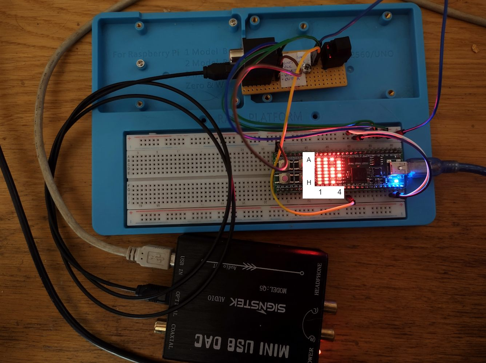

S/PDIF FPGA experiments
=======================

These design files are made for the Lattice
iCE40HX8K FPGA, particularly within the
[iceFUN module](https://www.robot-electronics.co.uk/icefun.html) from
Devantech. This FPGA is available in other breadboard-compatible modules,
and other FPGAs could be used instead, with a little porting work.

I tested the files in GHDL using simulated S/PDIF signals
and recorded S/PDIF data captured using a Picoscope.
It is easier to debug most problems with a logic simulator,
and by using GHDL I was able to get the design "mostly right" before
loading it onto the FPGA. My prior FPGA experience was almost entirely
with Xilinx tools but I found that 
[Lattice iCEcube2](https://www.latticesemi.com/iCEcube2) was similar
to Xilinx ISE from a decade ago, with essentially the same process and
the same main features.

S/PDIF bit exactness checker
============================

The first project is an FPGA implementation of the S/PDIF bit exactness
checker [from the parent directory](..). 
This design is able to correctly decode stereo S/PDIF at up to 96kHz
(I have no way to produce signals at a higher rate). I built and
tested the hardware on a breadboard.

Outputs
-------

Audio levels are reported using
a "[VU meter](https://en.wikipedia.org/wiki/VU_meter)" using LEDs
A1 .. H1 for the left channel, and A2 .. H2 for the right.

The audio signal is compared to the [test pattern](../README.md) in the
[test WAV files](../examples). 

The photo shows an earlier version of the design with different status
LED meanings. The status LEDs are now:

- LED B4 (near pin K14) = receiving correct "biphase mark code" signals
- LED C4 = receiving correct packet start codes
- LED D4 = receiving data with correct parity
- LED E4 = receiving test pattern
- LED F4 = generating output signal clock

LEDs A3 .. H3 show the number of clock cycles in a single-width pulse (A3 = LSB),
unless a test pattern is received (and E4 is on). In this case, E3 .. H3 indicate
the sample rate which is encoded within the test pattern:

- LEDs G3 and H3 on = sample rate is 96kHz
- LEDs F3, G3 and H3 on = sample rate is 48kHz
- LEDs E3, F3 and H3 on = sample rate is 44.1kHz
- LEDs G3 on = sample rate is 32kHz

When E4 is on, the quality of the test pattern is shown in LEDs A3 and B3:
- both off = test pattern not received
- A3 only = test pattern received: 16-bit data with a +1/-1 rounding error
- B3 only = test pattern received: bit-exact 16-bit data
- both on = test pattern received: bit-exact 24-bit data

The status LEDs in column 4 are not activated until the appropriate signal
has been received continuously for about 170 milliseconds (assuming
a 96MHz clock).

Components
----------

The [input decoder](spdif/input_decoder.vhdl) component decodes the incoming
"biphase mark code" signals, identifying single, double and triple-length
pulses in the S/PDIF data stream.
The single and double pulses represent binary data, while triple
pulses are used for synchronisation at the beginning of each packet.

The [packet decoder](spdif/packet_decoder.vhdl) component recognises the
start codes at the beginning of each packet. It asserts a start signal
at the beginning of the packet and a data signal for each bit.

The [channel decoder](spdif/channel_decoder.vhdl) component gathers the
data for each audio channel into a shift register and checks the parity.

The [matcher](app/matcher/matcher.vhdl) component compares the audio data to
the expected test pattern.

All four components have their own notion of what it means to be
"synchronised". The input decoder requires pulses of valid width - the
longest pulse cannot be more than 3 times the length of the shortest pulse
(though some margin of measurement error is tolerated). The packet decoder
requires valid start codes, the channel decoder requires correct parity, and
the matcher requires the test pattern.

Input decoder
-------------

I found the input decoder to be the most difficult component to debug.
The incoming pulses vary due to differences in clocking and analogue
effects, and so the timings tend to be a range, e.g. 15 .. 17 clock
cycles for a single-length pulse. The clock frequency of the FPGA
needs to be much higher than the clock frequency of the S/PDIF signal
so that there is a clearly measureable threshold to distinguish the
pulse lengths. If the clock frequency is too low, they are not clearly
distinguishable. The decoder measures the time for each pulse and
classifies it into bands, like this:

    T1 = measured shortest single-length pulse
    T2 = ceil(T1 * 1.75)
    T3 = ceil(T1 * 2.75)
    T4 = T1 * 4

    Measured time 0 .. T1-1   -> single length and adjust T1
    Measured time T1 .. T2-1  -> single length
    Measured time T2 .. T3-1  -> double length
    Measured time T3 .. T4-1  -> triple length
    Measured time T4 .. inf   -> error, force resynchronisation

Synchronisation is achieved when 7 sequential pulses can be
classified without an error. If a pulse shorter than T1 is
received, then T1 is adjusted - if the pulse is incorrect,
this will force resynchronisation because the T4 classification
becomes more likely. There is also a "watchdog" counter to detect 
situations where everything is misclassified as double or triple
length - this counter is reset by single-length pulses. It is needed
to force resynchronisation in cases where the sample rate changes
slightly.

I think it is probably possible to make a much better input decoder.
I chose 1.75 and 2.75 as multipliers rather than the more obvious
1.5 and 2.5 because T1 is the minimum pulse length rather than the
average, but this may not be the best approach.
I think the decoder ought to be able to work better at lower FPGA clock
frequencies; as it is, it was not able to decode at the 96kHz sample
rate until I increased the FPGA clock frequency above 48MHz. I think
commercial S/PDIF chipsets do not require such high frequencies.

Other issues and solutions
--------------------------

The Lattice iCEcube2 FPGA tools don't allow the pinout constraints (PCF)
files to contain tab characters, but the open-source programming tools
do allow this. Copying the PCF from the iceFUN samples led to warnings
and a non-functional design because the pin constraints didn't work.
This was solved by removing the tab characters.

The FPGA has 3.3V [LVTTL](https://en.wikipedia.org/wiki/Transistor%E2%80%93transistor_logic)
interfaces, but my S/PDIF optical interface
used TTL at 5V, so I needed to level-shift the 5V interface to 3.3V.
This proved more difficult than I expected, as I have quite limited
experience with analogue electronics. I tried a voltage divider, a
[resistor-transistor logic](https://en.wikipedia.org/wiki/Resistor%E2%80%93transistor_logic)
arrangement, and then various other transistor circuits including a
[TTL gate](https://en.wikipedia.org/wiki/Transistor%E2%80%93transistor_logic#/media/File:7400_Circuit.svg),
but none of these were able to operate at the >= 3MHz speeds needed
for the S/PDIF signals. The bipolar transistors switch on within a 
few nanoseconds, but it takes thousands of nanoseconds for them to switch off,
and though the TTL circuit helps with this, it is still too slow
to be useful. I had better results using FETs, especially with this elegant
[bidirectional level-shift circuit](http://husstechlabs.com/support/tutorials/bi-directional-level-shifter/),
which was fast enough to operate with the 48kHz sample rate.

Eventually I replaced all of these with an optical receiver from Cliff
Electronics (part number FCR684206R) that
can operate at 3.3V, eliminating the need for extra interface circuitry.
This worked reliably at 96kHz, and can be seen in the photo, along with
a matching optical transmitter (not connected). The FPGA acts as a passthrough,
delaying the signal by one clock cycle.

S/PDIF compressor 
=================

The second project is a digital audio compressor. The purpose is to normalise
the sound volume of a signal, i.e.
[dynamic range compression](https://en.wikipedia.org/wiki/Dynamic_range_compression).
The compressor measures the input volume and adjusts the gain in order
to ensure that the output volume level stays roughly constant.

This requires encoding the S/PDIF signal as well as decoding. A divider is
needed, because the basic operation is "audio out = audio in / max(recent audio in)".
Compressors may also have delays, filters and additional gain stages.

Encoders
--------

I began by implementing opposites of each of the decoding components,
i.e. a channel encoder, packet encoder and output encoder. I was able to test each
of these components individually by connecting it to the corresponding
decoder and checking that data could pass through both without loss. I would have
made progress faster if I had created more unit tests at this time - instead I relied
on a complete end-to-end test involving decoding, encoding and then decoding again,
and it was not always easy to debug test failures here since the root cause of a test
failure was far from the actual output.

The design was also not very efficient. 
My [input decoder](spdif/input_decoder.vhdl) will produce data at the same
rate as the input transitions, and this turned out to be unhelpful for the
output encoder, because the output encoder needed to determine its own data rate.
I used a FIFO buffer to decouple the input and output; this was an additional
component that I needed to build, but I figured I would need a FIFO anyway for
the compressor.

Later on, I was able to replace the individual encoding components with a
single [combined encoder](spdif/combined_decoder.vhdl) component which
didn't require a FIFO, using a single-entry buffer which could store the
next packet. This still allows some decoupling of input and output but
does not use so many FPGA resources.

Clock regenerator
-----------------

I needed to generate a clock signal to drive the S/PDIF output. This clock must
tick at an exact frequency of sample\_rate * 128, because sending the
data for each stereo channel requires up to 64 high/low transitions. For example:

| S/PDIF format   | Clock frequency |
| --------------- | --------------- |
| 32kHz stereo    | 4096kHz         |
| 44.1kHz stereo  | 5665kHz         |
| 48kHz stereo    | 6144kHz         |

Initially I intended to use
one of the ICE40's PLLs for this purpose, but I found that I could not configure the
frequency to match the 44.1kHz CD sample rate (or any multiple of it).

I decided instead to generate the output clock signal from the input, by measuring X, the
number of FPGA clock cycles needed to send Y packets. Using this, the hardware determines the number
of clock cycles between each output transition, which is X/64Y. This is not likely to
be an integer, so it's represented as a fixed point value. On each FPGA clock cycle,
a fixed-point value of 1.0 is added to an accumulator, and when it becomes larger than X/64Y,
the hardware subtracts X/64Y from the value and generates an S/PDIF clock pulse. The use
of fixed-point numbers accounts for the inexact ratio between the S/PDIF clock frequency and
the FPGA clock frequency.  [Here is the code](spdif/clock_regenerator.vhdl). The following
table shows the idealised number of FPGA clock cycles per S/PDIF clock cycle, assuming
perfect measurements:

| S/PDIF format   | X/64Y with 96MHz clock |
| --------------- | ---------------------- |
| 32kHz stereo    | 23.44                  |
| 44.1kHz stereo  | 17.01                  |
| 48kHz stereo    | 15.63                  |

The initial version did not attempt to synchronise to the beginning of
each packet, but this turned out to be a bad idea as the clocks drifted gradually
due to measurement errors and the imprecision of the fixed-point values.
Eventually, any FIFO buffer between input and output would overflow or drain, regardless
of its size. The solution was to periodically synchronise the output to the input, which
is done at the beginning of each input packet.

I also had trouble with the propagation delay through this part of the circuit. This lowered
the maximum clock frequency for the FPGA, which is bad. The problem was that I had both
an adder and a comparator in the data path between registers. Both the adder and the
comparator require carry chains, so there is a dependency between all of the bits. The
solution was to pipeline the regenerator further, with the adder and comparator in separate
stages. 

Experiments
-----------

Having created these encoders I was able to test them by applying simple audio
effects to the sample data, such as reducing the number of bits. I am interested
to know how many audio bits are actually necessary, and it seems to
me that 16 bits is probably more than necessary in most cases. The effect of reducing
the number of bits is that the noise level increases. With 8 bit samples, the
noise is quite noticeable, but with 14 bits it is really not. High bit depths (20 bit, 24 bit)
are probably overkill.

I was also able to experiment with recreating the subcode metadata which is part of
the S/PDIF data stream. This includes copy protection bits, so theoretically you could
bypass the copy protection by replacing them, though there are much easier ways to
make digital copies of music nowadays. The most interesting bit is the one which enables
[pre-emphasis](https://wiki.hydrogenaud.io/index.php?title=Pre-emphasis). In some DACs,
this enables a low-pass analogue filter after digital-analogue conversion, specified
in the CD standard and similar in purpose to the RIAA filter used for vinyl. 
CDs made since the 1980s have rarely used the pre-emphasis feature and I think it is
both poorly understood by users and poorly supported by audio software, partly because
it is so rarely important. However, it is supported by my DAC, and
the results of the filter are quite audible - higher frequencies
become quieter. (For some years I have wondered
what "mistake was made with the mastering" of Allister Brimble's album
[Sounds Digital](https://www.exotica.org.uk/wiki/Sounds_Digital), and having heard
this effect I am fairly sure it involved applying a pre-emphasis filter during
recording, and then not setting the corresponding flag when publishing the CD.) 

Division
--------

Building a compressor requires making a divider: the basic operation
is "audio out = audio in / max(recent audio in)". 

I implemented a [divider](lib/divider.vhdl) by repeated shifting and subtraction. I think
this is the usual method for building a hardware divider, and if you look at the
documentation for CPUs that are old or simple enough to give an instruction execution
time in clock cycles, you can see that they are using a similar approach.

The tradeoff here is between the minimum FPGA clock period (which is decreased
by splitting operations into smaller steps) and the time taken to process a sample
(which is increased by splitting operations into smaller steps). As there is no need
to process samples faster than the sample rate, a design can take hundreds of
clock cycles per sample. For instance, if the FPGA clock is 96MHz, and the
sample rate is 48kHz stereo, a new audio sample arrives every 1000 clock cycles.
This is plenty of time.

One misstep here was to try to build a signed divider, i.e. one which could work with
negative and positive numbers. This is pretty tricky to implement. It's normally achieved by converting
both numerator and denominator to positive numbers, and then correcting the sign afterwards.
But I had many problems caused by my attempt
to support [two's complement numbers](https://en.wikipedia.org/wiki/Two%27s_complement) in the divider.

By this time I was building unit tests for every component, which is very easy in VHDL, as
the simulation parts of the language are basically intended for it. While unit testing
I found various functionality bugs - such as the
"fun" special case where the minimum possible number (e.g. -128 for 8-bit) is divided by -1:
the result can't be represented as a two's complement number. 
(x86 CPUs will generate something like a divide by zero exception if you attempt such an operation,
other CPUs might act like you divided by 1, and in C the result may be affected by the horrible
[integer promotion](https://stackoverflow.com/questions/44455248/integer-promotion-in-c) feature,
a great source of surprising behaviour for the unwary.)

I needed to restructure the divider several times in order to improve the FPGA clock frequency.
Eventually I realised that I didn't need to use two's complement numbers inside the
compressor or divider, and could instead use signed-magnitude numbers, where the sign bit
is separate from the rest of the value. Conversion to two's complement is only necessary
at the input and output, since S/PDIF is two's complement. Signed-magnitude numbers led to a much
simpler implementation of both the divider and other compressor components.

Even with this change, the size of the numbers being divided is quite large, and so I also
implemented a [subtractor](lib/subtractor.vhdl) which operates on a configurable number
of bits at a time. This increases the number of clock cycles needed to carry out a division,
but also reduces the minimum FPGA clock period. I aimed for a "budget" of 500 clock cycles
per sample as the worst case, since this would allow operation at a 96kHz sample rate.

Compressor
----------

The current version of the compressor tracks the peak level in a register which decays
by 1dB every second (assuming a 48kHz sample rate). If a higher audio level reaches the compressor,
the peak level is immediately updated to match. This prevents any clipping. When the input audio level
falls, the gain is gradually increased. A short delay allows the volume to be adjusted
ahead of any change. There is a maximum gain (1.0) and a minimum (set at -21.1dB).

This design is very simple. Because it reacts immediately to a new peak level, the compressor's effect
is very noticeable, with an immediate drop in volume that can sometimes be noisy. Music often sounds
quite different when played through this device! 

User interface
--------------

During normal operation the 8x4 LED matrix shows two stereo VU meters, one for the input and one for
the output. Modes are selectable using a rotary switch and using two of the buttons on the iceFUN module;
when the mode changes, the new mode is briefly shown on the LEDs. The modes are:

- CX: compressor extreme - compress to maximum volume
- C2: compress to level 2
- C1: compress to level 1
- A1: attenuate to level 1 (reduce volume only - no compression)
- A2: attenuate to level 2 (reduce volume only - no compression)
- P: passthrough

Level 1 and level 2 are set using potentiometers connected to the analogue inputs of the iceFUN module.
The FPGA does not have analogue inputs but the iceFUN has a PIC (used for programming) which
acts as an analogue interface when the FPGA is running. To avoid the possibility of noise being
introduced via these inputs, they are only sampled on startup, and when the top left button is held
down.

There are some "debug" modes which are not selectable via the rotary switch, but are still reachable
using the bottom left and bottom right buttons. They are:

- D1: S/PDIF input information, consisting of:
  - top line: the single transition time, in FPGA clock cycles, e.g. 15 for 48kHz input.
  - middle lines: the clock interval as measured by clock\_regenerator. This is the time in
    clock cycles for 16 packets. This value will not be stable as it is measured continuously.
  - bottom line: sync signals from decoders, compressor and encoders - 1 in normal operation.
- D2: Subcode information
  - These are the first 32 bits of the subcode. The first bit appears in the top left, the 32nd in the bottom right.
  - These bits are generated by the S/PDIF output device. If this is a PC, or some USB device, the bits are
    probably not very meaningful.
- D3: Compressor peak level
  - This is the peak level as measured by the compressor. It is a 24-bit fixed point value, with a possible value
    in the range [0.0, 2.0). Smaller values mean greater amplification. The value decays at 1dB per second
    towards a minimum value, but is reset to a new peak value whenever the input is larger. For this purpose
    the input is treated as a value [0.0, 1.0). 
- D4: ADC information and errors
  - The top line shows error bits from various modules. 

