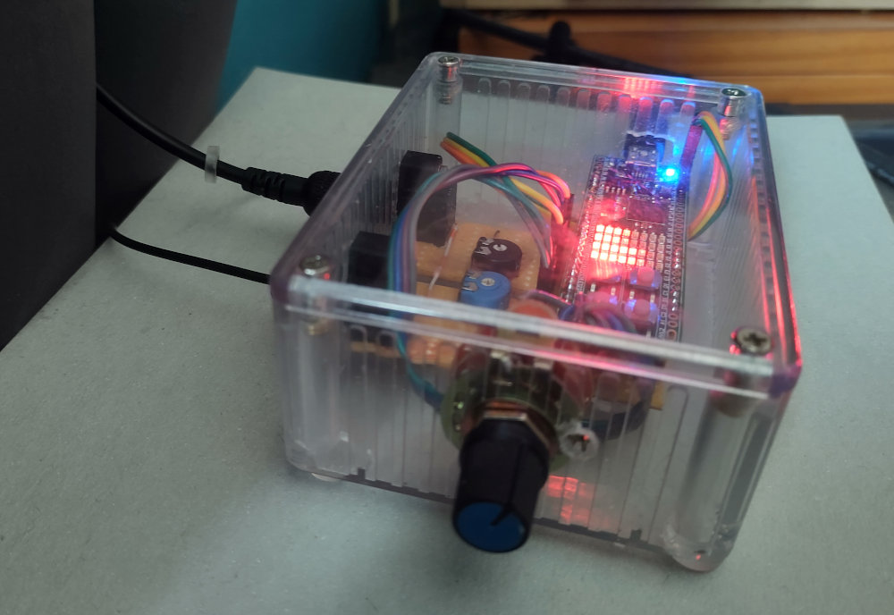
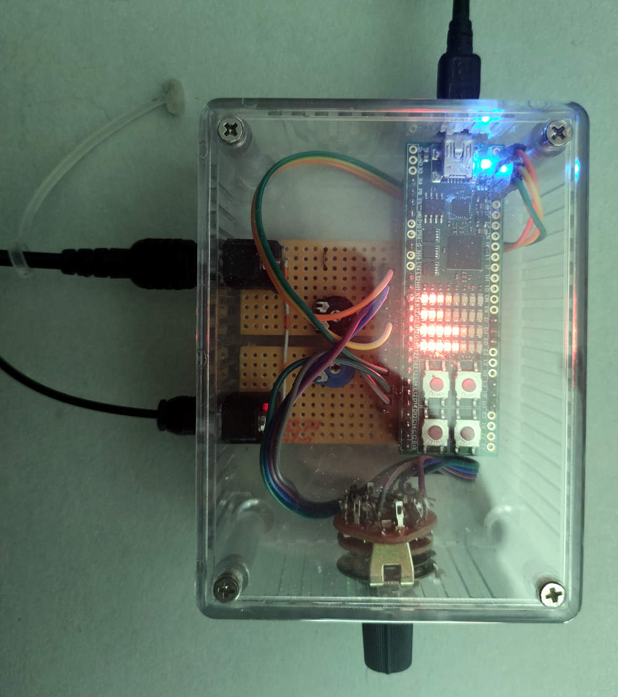
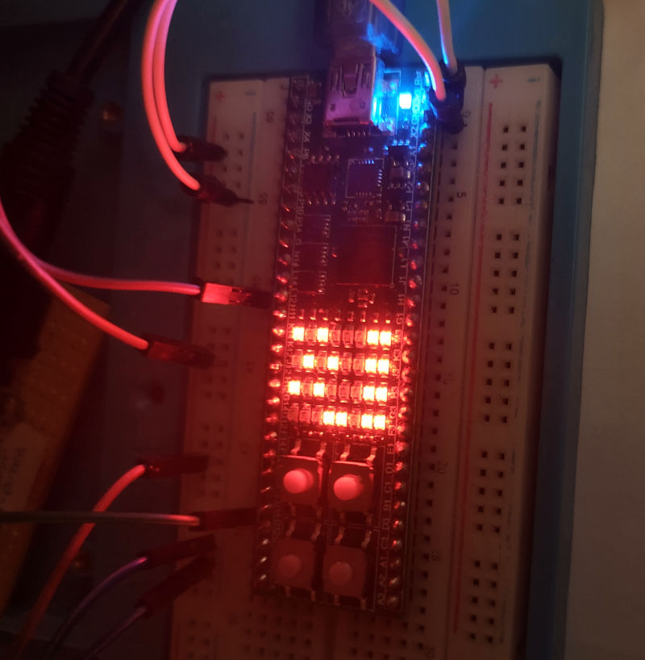

S/PDIF FPGA project
===================

This directory has an FPGA design intended for the Lattice
[iCE40HX8K FPGA](https://www.latticesemi.com/Products/FPGAandCPLD/iCE40).
The target board is the
[iceFUN module](https://www.robot-electronics.co.uk/icefun.html) from
Devantech. The same FPGA is available in other breadboard-compatible modules,
and other FPGAs could be used instead, with a little porting work, as
the only device-specific parts of the design are the PLL and block RAM
interfaces.

This design includes a subsystem for bit-exactness tests as described
[in the parent directory](..), but the real purpose of the design is
to act as a
[dynamic range compressor](https://en.wikipedia.org/wiki/Dynamic_range_compression)
for digital sound. This was created to solve the problem of wildly different
sound levels from a PC. The aim was to produce a reliable and consistent
output level which could be adjusted easily.

Hardware
--------

Here is the finished device:

The box has an S/PDIF input and output. It is powered by USB (plugged directly
into the iceFUN FPGA module) and the rotary control on the front allows one
of six modes to be selected. These enable/disable compression and set the output
level. The iceFUN module is plugged into stripboard with a few components (notably
the optical receiver and transmitter, and analogue presets to set output levels).

I used a transparent box so that the LEDs on the iceFUN module would be easily
visible. They normally act as dual stereo VU meters for the input
and output signal, but they also show the mode (temporarily) when the rotary
control changes position, and indicate other events such as a loss of input signal.

The front of the device is the rotary control, so when I refer to the "top row" of
LEDs, I mean the top row as viewed from the front. This is the row furthest from the
buttons on the iceFUN module. The "top left" button is the one closest
to the "bottom left" LED. This picture shows the LEDs and buttons in the
correct orientation:

The FPGA design only requires the iceFUN module and an S/PDIF input: other components
are optional. For example, the compression mode can also be selected using the
bottom left and bottom right buttons. The modes are:

- CX: compressor extreme - compress to maximum volume
- C2: compress to level 2
- C1: compress to level 1
- A1: attenuate to level 1 (reduce volume only - no compression)
- A2: attenuate to level 2 (reduce volume only - no compression)
- P: passthrough

Level 1 and level 2 are set using the analogue presets connected to
the iceFUN module. To avoid introducing noise to the digital signal,
the presets are only sampled on startup and when the top left button is held down.

Bit-exactness checking
----------------------

My initial work on this project was just an FPGA implementation of the
S/PDIF bit exactness checker, and this is still a feature of the finished
device, which is able to decode and check stereo S/PDIF at up to 96kHz.
Initial versions were built on [breadboard](../img/fpga.jpg). If a bit-exact
test pattern is received, the top three rows of LEDs display one of the following
patterns:

    1.1....1
    .1.1...1         16-bit input with 1-bit rounding
    1.1....1

    1.1...11
    .1.1..11         16-bit exact input
    1.1...11

    1.1..111
    .1.1.111         24-bit exact input
    1.1..111

Here is an example showing 16-bit exact input.

The output of the device is only bit-exact in the passthrough mode,
as the compressor usually alters the volume, and only operates on 16 bit
data in any case.

Development and testing
-----------------------

Initially I tested the design using [GHDL](https://github.com/ghdl/ghdl)
in a end-to-end integration test where simulated S/PDIF signals
or recorded S/PDIF data (from Picoscope) were passed through the components.
Later on, I also developed unit tests for components, because the end-to-end
test was not easy to debug as the complexity of the design grew.
VHDL is ideal for unit testing. The simulation parts of the language are
basically intended for it. You can mix code that only works when testing (i.e. simulation)
with code that works in normal usage, and the distinction is obvious from the
different nature of the code, with "non-synthesisable" parts resembling a sequential
programming language in which the passage of time and handling of events are
first-order language features.

By using GHDL I was able to get the design "mostly right" before
loading it onto the FPGA. My prior FPGA experience was almost entirely
with Xilinx tools but I found that 
[Lattice iCEcube2](https://www.latticesemi.com/iCEcube2) was similar
to Xilinx ISE as I remembered it from a decade ago, with essentially
the same process and the same main features. Synopsis Synplify is
used for synthesis, with Lattice-specific tools for place and route.
I understand there are also some [open-source tools
for this FPGA](https://github.com/YosysHQ/icestorm) but I have not tried these out.

Components and challenges
=========================

Input decoder
-------------

I found the [input decoder](spdif/input_decoder.vhdl) to be a difficult
component to design and debug. This component decodes the incoming
"biphase mark code" signals, identifying single, double and triple-length
pulses in the S/PDIF data stream.

Other S/PDIF decoders might classify the input signal as one of the
standard sample rates allowed for S/PDIF, such as 44.1kHz or 48kHz,
and then decode on that basis,
but I did not want to have any dependence on a particular format
and wanted to support S/PDIF at any sample rate. This is possible
by measuring the pulse lengths.

There are technical challenges, not least that the input can change
frequency at any time. It may also become disconnected, it can be noisy,
and the measurements are not perfectly accurate due to differences in clocking and analogue
effects. The timings tend to be a range, e.g. 15 .. 17 clock
cycles for a single-length pulse is typical for a 48kHz input, given
a 96MHz FPGA clock. The clock frequency of the FPGA
needs to be much higher than the clock frequency of the S/PDIF signal
so that there is a clearly measureable threshold to distinguish the
pulse lengths. If the clock frequency is too low, they are not clearly
distinguishable.

Initially the decoder measured the length of the shortest pulse, and used this
as a basis to distinguish longer pulses, knowing that they would be two or
three times longer:

    T1 = measured shortest single-length pulse
    T2 = ceil(T1 * 1.75)
    T3 = ceil(T1 * 2.75)
    T4 = T1 * 4

    Measured time 0 .. T1-1   -> single length and adjust T1
    Measured time T1 .. T2-1  -> single length
    Measured time T2 .. T3-1  -> double length
    Measured time T3 .. T4-1  -> triple length
    Measured time T4 .. inf   -> error, force resynchronisation

However, the effect of error is most significant when measuring the shortest pulse;
an error of one clock cycle here will alter T3 by around 3 clock cycles. The
input decoder could easily become "confused" by short pulses and would misclassify
all other pulses. I added consistency checks to the component based on the
expected contents of incoming packets - for example, in correct S/PDIF, it's
not possible to have three triple-length pulses without at least one pulse of
length one. If these checks fail, resynchronisation is forced.

The current version of the decoder measures both the shortest and the longest pulses,
and uses both to calculate the thresholds. It assumes that the transmitter
generates packets of length T1, 2 x T1 and 3 x T1, but each is affected by a measurement
error +/- E. The minimum measured time is T1 - E, and the maximum is 3 x T1 + E.
The error may be "cancelled" by adding these together, producing 4 x T1, from where
we can calculate the timing thresholds to distinguish pulse lengths. I found this
worked very well even with 96kHz inputs. Supporting higher input rates would
require a faster FPGA clock - I think this is not possible with the hardware I have.
(In any case I don't hear any benefit from sample rates above 44.1/48kHz.)

Packet and channel decoders
---------------------------

The [packet decoder](spdif/packet_decoder.vhdl) component recognises the
start codes at the beginning of each packet. It asserts a start signal
at the beginning of the packet and a data signal for each bit. This
consists of a single state machine which detects S/PDIF packet headers.

The [channel decoder](spdif/channel_decoder.vhdl) component gathers the
data for each audio channel into a shift register and checks the parity.

Tool issues
-----------

The Lattice iCEcube2 FPGA tools don't allow the pinout constraints (PCF)
files to contain tab characters, but the open-source programming tools
for iCE40 FPGAs do allow this. Copying PCF files from the iceFUN samples led to warnings
and a non-functional design because the pin constraints didn't work.
In common with older Xilinx tools, the Lattice tools do not produce errors
if inputs/outputs don't have pin assignments (though a build without pin
constraints will be useless) and so you have to read the log files carefully
to find the relevant warnings. The problem was solved by removing the tab
characters (once I realised the problem).

Hardware interfacing
--------------------

The FPGA has 3.3V [LVTTL](https://en.wikipedia.org/wiki/Transistor%E2%80%93transistor_logic)
interfaces, but my S/PDIF optical interface
used TTL at 5V, so I needed to level-shift the 5V interface to 3.3V.
This proved more difficult than I expected, as I have quite limited
experience with analogue electronics. I tried a voltage divider, a
[resistor-transistor logic](https://en.wikipedia.org/wiki/Resistor%E2%80%93transistor_logic)
arrangement, and then various other transistor circuits including a
[TTL gate](https://en.wikipedia.org/wiki/Transistor%E2%80%93transistor_logic#/media/File:7400_Circuit.svg),
but none of these were able to operate at the > 4MHz speeds needed
for the S/PDIF signals. In "obvious" configurations, bipolar transistors switch on within a 
few nanoseconds, but it takes a microsecond or more for them to switch off,
and though the TTL circuit helps with this, it is still too slow
to be useful. I had better results using FETs, especially with this elegant
[bidirectional level-shift circuit](http://husstechlabs.com/support/tutorials/bi-directional-level-shifter/),
which was fast enough to operate with the 48kHz sample rate.

Eventually I replaced all of these with optical receivers and transmitters from Cliff
Electronics (e.g. part number FCR684206R). These
can operate at 3.3V, eliminating the need for extra interface circuitry.
This worked reliably at 96kHz, and can be seen in the photos above.

Encoders
--------

To produce S/PDIF output, I began by implementing opposites of each of the decoding components,
i.e. a channel encoder, packet encoder and output encoder. I was able to test each
of these components individually by connecting it to the corresponding
decoder and checking that data could pass through both without loss.

This worked, but I would have made progress faster if I had created more unit tests at this
time - instead I relied on a complete end-to-end test involving decoding, encoding and then
decoding again, and it was not always easy to debug test failures here since the root cause of a test
failure was far from the actual output.

The initial output decoder included a FIFO to decouple the input and output,
allowing the output to be independently clocked. Later on,
I was able to replace the individual encoding components with a
single [combined encoder](spdif/combined_decoder.vhdl) component which
didn't require a FIFO, using a single-entry buffer which could store the
next packet.

Clock regenerator
-----------------

I needed to generate a clock signal to drive the S/PDIF output. The clock frequency is
twice the single transition time (i.e. T1) used by the input decoder. This must be
sample\_rate * 128, because sending the
data for each stereo channel requires up to 64 high/low transitions. For example:

| S/PDIF format   | Clock frequency |
| --------------- | --------------- |
| 32kHz stereo    | 4.10MHz         |
| 44.1kHz stereo  | 5.67MHz         |
| 48kHz stereo    | 6.14MHz         |
| 96kHz stereo    | 12.3MHz         |

Initially I intended to use
one of the ICE40's PLLs for this purpose, but I found that I could not configure the
frequency to match the 44.1kHz CD sample rate (or any multiple of it).

I decided instead to generate the output clock signal from the input, by measuring X, the
number of FPGA clock cycles needed to send Y packets. Using this, the hardware determines the number
of clock cycles between each output transition, which is X/64Y. This is not likely to
be an integer, so it's represented as a fixed point value. On each FPGA clock cycle,
a fixed-point value of 1.0 is added to an accumulator, and when it becomes larger than X/64Y,
the hardware subtracts X/64Y from the value and generates an S/PDIF clock pulse. The use
of fixed-point numbers accounts for the inexact ratio between the S/PDIF clock frequency and
the FPGA clock frequency.  [Here is the code](spdif/clock_regenerator.vhdl). The following
table shows the idealised number of FPGA clock cycles per S/PDIF clock cycle, assuming
perfect measurements:

| S/PDIF format   | X/64Y with 96MHz clock |
| --------------- | ---------------------- |
| 32kHz stereo    | 23.44                  |
| 44.1kHz stereo  | 17.01                  |
| 48kHz stereo    | 15.63                  |
| 96kHz stereo    | 7.81                   |

The initial version did not attempt to synchronise to the beginning of
each packet, but this turned out to be a bad idea as the clocks drifted gradually
due to measurement errors and the imprecision of the fixed-point values.
Eventually, any FIFO buffer between input and output would overflow or drain, regardless
of its size. The solution was to periodically synchronise the output to the input, which
is done at the beginning of each input packet.

I also had trouble with the propagation delay through this part of the circuit. This lowered
the maximum clock frequency for the FPGA, which is bad. The problem was that I had both
an adder and a comparator in the data path between registers. Both the adder and the
comparator require carry chains, so there is a dependency between all of the bits. The
solution was to pipeline the regenerator further, with the adder and comparator in separate
stages. 

Subcodes
--------

The S/PDIF output encoder does not just deal with audio data. It also produces
subcode metadata. 192 bits are sent alongside the audio signal, one bit at a time.
This includes copy protection bits, so theoretically you could
bypass the copy protection by replacing them, though there are much easier ways to
make digital copies of music nowadays.

I think the most interesting subcode bit is the one which enables
[pre-emphasis](https://wiki.hydrogenaud.io/index.php?title=Pre-emphasis). In some DACs,
this enables a low-pass analogue filter after digital-analogue conversion, specified
in the CD standard and similar in purpose to the RIAA filter used for vinyl. 
CDs made since the 1980s have rarely used the pre-emphasis feature and I think it is
both poorly understood by users and poorly supported by audio software, partly because
it is so rarely important. However, it is supported by my DAC, and
the results of the filter are quite audible - higher frequencies
become quieter. (For some years I have wondered
what "mistake was made with the mastering" of Allister Brimble's album
[Sounds Digital](https://www.exotica.org.uk/wiki/Sounds_Digital), and having heard
this effect I am fairly sure it involved applying a pre-emphasis filter during
recording, and then not setting the corresponding flag when publishing the CD.) 

In the design, pressing the top right button will temporarily enable the preemphasis bit,
showing whether a DAC supports it or not. Cheaper DACs do not. I have not attempted
to pass the preemphasis bit through from the decoder - PC S/PDIF output hardware
doesn't support it, as far as I can tell (there's no driver interface that I know of).
In fact one of the PC S/PDIF output devices that I tested actually leaves the bit
enabled all the time, which is definitely incorrect!

Division
--------

Building a compressor requires making a divider: the basic operation
is "audio out = audio in / max(recent audio in)". 

I implemented a [divider](lib/divider.vhdl) by repeated shifting and subtraction. I think
this is the usual method for building a hardware divider, and if you look at the
documentation for CPUs that are old or simple enough to give an instruction execution
time in clock cycles, you can see that they are using a similar approach.

The tradeoff here is between the minimum FPGA clock period (which is decreased
by splitting operations into smaller steps) and the time taken to process a sample
(which is increased by splitting operations into smaller steps). As there is no need
to process samples faster than the sample rate, a design can take hundreds of
clock cycles per sample. For instance, if the FPGA clock is 96MHz, and the
sample rate is 48kHz stereo, a new audio sample arrives every 1000 clock cycles.
This is plenty of time.

One misstep here was to try to build a signed divider, i.e. one which could work with
negative and positive numbers. This is pretty tricky to implement. It's normally achieved by converting
both numerator and denominator to positive numbers, and then correcting the sign afterwards.
But I had many problems caused by my attempt
to support [two's complement numbers](https://en.wikipedia.org/wiki/Two%27s_complement) in the divider.

I had trouble finding an efficient and correct way to support two's complement numbers.
I also hit the "fun" special case where the minimum possible number is divided by -1,
e.g. (for 8-bit) -128 / -1. The result can't be represented as a two's complement number. 
(x86 CPUs will generate something like a divide by zero exception if you attempt such an operation,
other CPUs might act like you divided by 1, and in C the result may be affected by the horrible
[integer promotion](https://stackoverflow.com/questions/44455248/integer-promotion-in-c) feature,
a great source of surprising behaviour for the unwary.)

I needed to restructure the divider several times in order to improve the FPGA clock frequency.
Eventually I realised that I didn't need to use two's complement numbers inside the
compressor or divider, and could instead use signed-magnitude numbers, where the sign bit
is separate from the rest of the value. Conversion to two's complement is only necessary
at the input and output, since S/PDIF is two's complement. Signed-magnitude numbers led to a much
simpler implementation of both the divider and other compressor components.

Even with this change, the size of the numbers being divided is quite large, and so I also
implemented a [subtractor](lib/subtractor.vhdl) which operates on a configurable number
of bits at a time. This increases the number of clock cycles needed to carry out a division,
but also reduces the minimum FPGA clock period. I aimed for a "budget" of 500 clock cycles
per sample as the worst case, since this would allow operation at a 96kHz sample rate.

Compressor
----------

The current version of the compressor tracks the peak level in a register which decays
by 1dB every second (assuming a 48kHz sample rate). If a higher audio level reaches the compressor,
the peak level is immediately updated to match. This prevents any clipping. When the input audio level
falls, the gain is gradually increased. A short delay allows the volume to be adjusted
ahead of any change. There is a maximum gain (1.0) and a minimum (set at -21.1dB).

This design is very simple. Because it reacts immediately to a new peak level, the compressor's effect
is very noticeable, with an immediate drop in volume that can sometimes be noisy. Music often sounds
quite different when played through this device! Some types of music will certainly sound
bad - Beethoven doesn't work very well, for example. But on the whole, it works very well,
ensuring that nothing is too loud or too quiet. If necessary, the compressor can be bypassed
by selecting the passthrough mode.

Multipliers and ADCs
--------------------

I wanted the compressor to operate at more than one output volume, and to be able
to make adjustments. Four of the operation modes set the volume according to
potentiometers connected to the analogue inputs of the iceFUN module.
The FPGA does not have analogue inputs but the iceFUN has a PIC (used for programming) which
acts as an analogue interface when the FPGA is running. This is accessed using a
serial protocol resembling RS232.

The values from the analogue-to-digital converters (ADCs) are 10 bit. They are fed into a
multiplier within the compressor which is applied to the input signal before division
but after the peak level is determined. Like the divider, the multiplier operates by
repeated shifting. To avoid the possibility of noise being introduced via these inputs,
they are only sampled on startup, and when the top left button is held down.

Debug modes
-----------

During normal operation the 8x4 LED matrix shows two stereo VU meters, one for the input and one for
the output. Modes are selectable using a rotary switch and using two of the buttons on the iceFUN module;
when the mode changes, the new mode is briefly shown on the LEDs. The modes are:

- CX: compressor extreme - compress to maximum volume
- C2: compress to level 2
- C1: compress to level 1
- A1: attenuate to level 1 (reduce volume only - no compression)
- A2: attenuate to level 2 (reduce volume only - no compression)
- P: passthrough

There are some "debug" modes which are not selectable via the rotary switch, but are still reachable
using the bottom left and bottom right buttons. They are:

- D1: S/PDIF input information, consisting of:
  - top line: the single transition time, in FPGA clock cycles, e.g. 15 for 48kHz input.
  - middle lines: the clock interval as measured by clock\_regenerator. This is the time in
    clock cycles for 16 packets. This value will not be stable as it is measured continuously.
  - bottom line: sync signals from decoders, compressor and encoders - 1 in normal operation.
- D2: Subcode information
  - These are the first 32 bits of the subcode. The first bit appears in the top left, the 32nd in the bottom right.
  - These bits are generated by the S/PDIF output device. If this is a PC, or some USB device, the bits are
    probably not very meaningful.
- D3: Compressor peak level
  - This is the peak level as measured by the compressor. It is a 24-bit fixed point value, with a possible value
    in the range [0.0, 2.0). Smaller values mean greater amplification. The value decays at 1dB per second
    towards a minimum value, but is reset to a new peak value whenever the input is larger. For this purpose
    the input is treated as a value [0.0, 1.0). 
- D4: ADC information and errors
  - The top line shows error bits from various modules. These are latched, and so they stay
    in place until the top right button is pressed (resetting them).
    - 7: (top left LED) output encoder FIFO error
    - 6: ADC capture error (timeout reading from PIC)
    - 5: compressor FIFO error
    - 4: compressor overflow error
    - 3: desync error
    - 2: top right button is pressed (resets errors)
    - 1, 0: bits 9 and 8 of ADC 2
  - The next line shows bits 7 to 0 of ADC 2
  - The bottom two lines show ADC 1
- D5: Git revision
  - The first 32 bits of the number produced by "git rev-parse HEAD" at build time.
  - The most significant bit appears in the top left.

No CPU, no software
-------------------

It may be surprising how much can be achieved without any CPU, microcontroller,
firmware or software of any sort. The design relies entirely on state machines
described in VHDL to provide all of the control and sequencing needed to drive
audio data through multipliers, dividers and comparators, draw status information
on LEDs, and even send/receive serial data.

This would be a totally impractical approach if the design were built in
discrete logic (e.g. with 74-series gates), where such tasks would surely be
carried out by a microcontroller of some kind. Only the most time-critical operations
would be done in pure hardware. However, the approach becomes practical thanks to
synthesis tools which quickly convert the VHDL into a "netlist" of logic gates
with arbitrary complexity. The FPGA has enough space for the design to be made in
this way. I have previously based FPGA designs around CPU cores, and I find that
they generally take up a lot of space even for relatively simple 8-bit designs.
You need resources dedicated to RAM and ROM, though block RAMs can act as both,
as they can be initialised by the FPGA bit file. Interfacing to other hardware
also requires adding I/O devices to the CPU data bus. This complexity is not
necessary here.

An advantage of this no-software design is that the timing is totally predictable.
The deadline for processing each S/PDIF packet is always met, because the hardware
always requires the same number of clock cycles regardless of the input data.
The multiplier and divider could take shortcuts for specific inputs, but there is
no benefit to that, because nothing more can be done in the time which would be saved.
With software there may be variation in timing due to different paths through the
program (i.e. branching) and it can be tricky to work out the worst case execution time.
The problem becomes worse if the CPU is even slightly complex, e.g. pipelined,
or if the CPU is shared between multiple tasks. In pure hardware, with each
component dedicated to a particular task, we need only a single measurement to
determine both the best and the worst case. [One of the tests](test/test_measure.vhdl)
carries out such a measurement to check that a 96kHz sample rate is supported.

Artefacts
---------

- [Schematic diagram](../img/diagram1.jpg) - virtually all components are within the
  iceFUN module
- [Circuit board layout](../img/diagram2.jpg) - each square = 0.1 inches, matching
  the pitch of the prototyping board and iceFUN pinout
- [Photo from above](../img/above.jpg) and [from the front](../img/box.jpg)
- [FPGA bit file](hardware_8.bin) matching tag 'hardware\_8'

For more information about the iceFUN module see the manufacturer's
[webpage](https://www.robot-electronics.co.uk/products/icefun.html) and
[documentation](https://www.robot-electronics.co.uk/files/iceFUNdoc.pdf).

