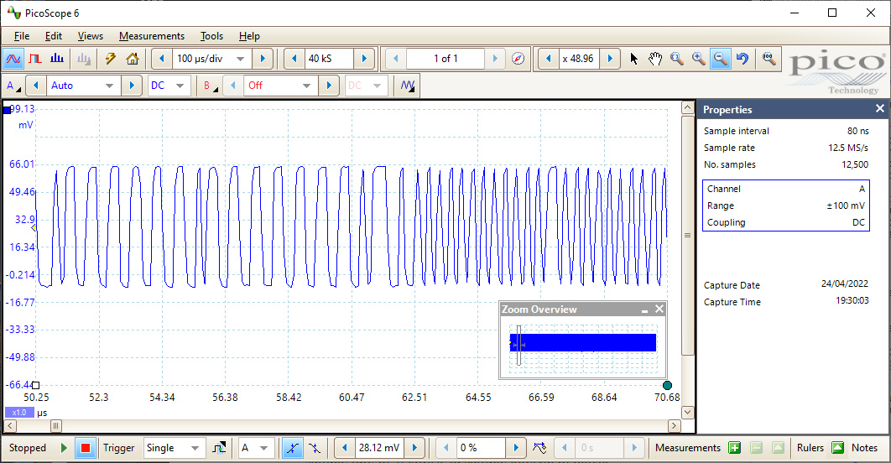

S/PDIF decoder oscilloscope experiments
=======================================

To check the accuracy of the S/PDIF output using a storage oscilloscope,
connect the scope to the coaxial output, or connect to the optical output
via a suitable converter.

I used [Picoscope](https://www.picotech.com/products/oscilloscope) for this,
but any storage scope could be used, provided that the data can be saved in
a file.

You will need to record for at least 1ms in order to capture
more than 40 audio samples. The oscilloscope sample rate should be as high as possible
while still capturing samples for 1ms. I got good results with a sample rate of 12.5MHz
(a sample interval of 80ns).

Export the oscilloscope recording as a CSV file.

Run the [sigtest.py](sigtest.py) program on the CSV file, e.g.

    python sigtest.py c:\temp\20220410-0001.csv

If your S/PDIF output is 24-bit and you have configured your device drivers and
music player software so that audio data is passed through exactly,
then you will see something like this:

    > python sigtest.py ..\examples\test_44100_24_bit.csv
    Oscilloscope clock period 0.080 microseconds
    Oscilloscope clock frequency 12.500 MHz
    Signal peak-to-peak: -8.493 to 66.012
    Signal midpoint: 28.674
    hold_time width 2 has count 1743
    hold_time width 3 has count 472
    hold_time width 4 has count 864
    hold_time width 5 has count 652
    hold_time width 6 has count 47
    hold_time width 7 has count 86
    S/PDIF clock frequency 3.125 MHz
    width0 2
    width1 4
    width2 6
    resync at 32
    Packets 89
    Malformed packet - wrong size (skip)
    Audio data received:
    257600 7d5600
    ...
    f66900 51f300
    b61800 1d7600
    4dc100 db5e00
    Sample rate of test data: 44100 Hz
    Walking ones are perfectly correct for 16-bit
    Walking ones are perfectly correct for 24-bit
    Correct 16-bit payload part: signal is 16-bit clean
    Correct 24-bit payload part: signal is 24-bit clean

If your S/PDIF output is limited to 16 bits by hardware, but all other configuration
is correct, then messages similar to the following will be shown:

    > python sigtest.py ..\examples\test_44100_16_bit.csv
    ...
    Sample rate of test data: 44100 Hz
    Walking ones are correct for 16-bit with at most +/- 1 bit error
    Correct 16-bit payload part: signal is 16-bit clean
    at 32 (24-bit): expect e3b30d 0c8faf  got e3b300 0c9000
    Error in 24-bit payload part, position 32: signal is not 24-bit clean

If you have not successfully captured S/PDIF data with your oscilloscope,
or your CSV file format is incorrect, then you will see error messages
from sigtest.py. Ensure that a clear waveform is captured for sufficient time.
If you are not using Picoscope, you may need to replace the
[picoscope\_decode.py](picoscope_decode.py) method with something
appropriate for your oscilloscope's output format.

If your configuration is incorrect, then the output may be processed in various ways
by your music player software, the OS, or device drivers. In this case you
will see some audio data, but it won't be a bit-exact copy of the test pattern.

The sigtest.py program will print messages such as:

    Unable to find the 654321 marker within the audio data

This either means that the output is not bit-exact, or that the test WAV file was not
playing. In some cases you can also see a hint about the problem, like this:

    Unable to find the 654321 marker within the audio data
    Possible marker at position 6 with volume level reduced to 0.985: sample rate 44042 Hz ?

This is typical of the output seen when playing the WAV file on Windows via the
"shared mode" audio pathway, which is the default. This is often called
"Primary Sound Driver" and/or "Windows DirectSound". It occurs even if volume controls
are turned to maximum. [One of the example files](../examples/test_44100_ds.csv) was captured
in this way.

If you do not see this second message, Windows might be resampling the audio data to
a higher sample rate. Try the 48kHz test pattern, as the default Windows configuration
resamples all sounds to 16-bit 48kHz.
